# NextGenLab: Science vs Instinct

> **2D Asymmetric Multiplayer Sci-Fi Horror Game**

Dua pemain. Dua peran berlawanan. Satu laboratorium yang penuh bahaya.

<p align="center">
  
</p>

<p align="center">
  <a href="https://akbarfaraby.itch.io/nextgen-lab-project-science-vs-instinct">
    
  </a>
</p>

---

## Fitur Utama

- **Asimetris sejati** — Peneliti dan Monster punya mekanisme yang sama sekali berbeda
- **Dua fase gameplay** — PREPARATION (stealth + task) → DUEL (combat arena)
- **Sistem evolusi Monster** — 9 gen yang dapat dipilih saat level up, membentuk playstyle unik
- **Fog of War** — Peneliti hanya melihat area terbatas; sabotase Lights Out memperparahnya
- **Two-round task system** — Setiap task butuh 2 ronde dengan jeda cooldown
- **Multiplayer online** — Room publik/privat, matchmaking, WebSocket real-time
- **Crafting & inventory** — Kumpulkan resource dari chest, craft item di workshop
- **Guard NPC** — AI patrol yang menyerang Monster dan respawn setelah mati
- **Sistem ELO + Leaderboard** — Rating berubah setiap pertandingan
- **Achievement** — 10 achievement yang bisa dibuka

---

## Cara Bermain

### Sebagai Peneliti

Tujuan: Selesaikan **5 task laboratorium** sebelum waktu habis atau sebelum Monster mencapai level maksimum.

Setiap task memiliki **2 ronde** — selesaikan ronde 1, tunggu 20 detik cooldown, lalu selesaikan ronde 2. Tiap ronde yang selesai mengirim 10 progres ke backend (total 100 = selesai).

**Task yang tersedia:**
- Rangkaian Kawat
- Server Hack
- Reaktor
- Campuran Kimia
- Biometric Lock

**Tips:**
- Gunakan Stun Gun atau Taser untuk melumpuhkan Monster sementara
- Loot chest untuk mendapat resource dan crafting items
- Pasang Trap untuk menghalangi jalur Monster
- Gunakan Decoy untuk mengalihkan perhatian Monster dan Guard
- Perhatikan marker task: hijau = tersedia, oranye = cooldown (hitung mundur di atas marker), abu-abu = selesai

### Sebagai Monster

Tujuan: Bunuh Peneliti atau capai **level 5** sebelum semua task diselesaikan.

Bunuh Guard untuk mendapat XP (+25 XP per Guard). Saat level up, pilih satu **gen evolusi** yang meningkatkan kemampuan Monster.

**Gunakan sabotase panel:**
- **Lights Out** — Matikan lampu, Peneliti hanya melihat radius 96px
- **Slow Field** — Perlambat pergerakan Peneliti
- **Serum Drain** — Reset salah satu task yang sudah selesai

---

## Kontrol

### Peneliti
| Tombol | Aksi |
|---|---|
| `WASD` | Gerak |
| `Shift` | Sprint |
| `Klik Kiri` | Tembak senjata |
| `Tab` | Ganti senjata (cycle slots) |
| `F` | Gunakan utilitas (Heal Kit / Trap / Decoy) |
| `E` | Interaksi — task zone / buka chest / buka workshop |
| `R` | Reload senjata |
| `I` | Buka/tutup inventory |
| `ESC` | Batalkan task / tutup panel |

### Monster
| Tombol | Aksi |
|---|---|
| `WASD` | Gerak |
| `Klik Kiri` | Serangan melee |
| `Space` | Dash |
| `Q` | Echolocation — deteksi posisi pemain |
| `G` | Phase Shift — tembus dinding sementara |
| `E` | Gunakan sabotase panel |

---

## Sistem Senjata Peneliti

Peneliti dapat menyimpan hingga **3 senjata** sekaligus (looted dari chest). Tekan `Tab` untuk cycle.

| Senjata | Ammo | Fase Prep | Duel |
|---|---|---|---|
| Stun Gun | 8 | ✅ | ✅ |
| Taser | 5 | ✅ | ✅ |
| Pistol | 12 | ❌ | ✅ |
| Rail Gun | 4 | ❌ | ✅ |
| Acid Grenade | 3 | ❌ | ✅ |

---

## Sistem Evolusi Monster

Monster mendapat XP dari membunuh Guard (+25 XP) dan naik level (maks level 5). Setiap level up memilih **satu gen**:

| Gen | Efek |
|---|---|
| Predator Claws | Melee damage +1 |
| Adrenal Surge | Kecepatan +20% |
| Thick Hide | Max HP +1 |
| Frenzy | Damage meningkat saat HP rendah |
| Echolocation | Deteksi posisi pemain di peta |
| Acidic Blood | Aura damage di sekitar Monster |
| Regeneration | Regen HP saat tidak dalam combat |
| Phase Shift | Tembus dinding sementara |
| Berserker | Damage ×1.3 saat HP kritis |

---

## Buff Masuk Fase Duel

Siapa yang menyelesaikan kondisinya lebih dulu mendapat **buff permanen** selama Duel:

| Kondisi | Buff yang Didapat |
|---|---|
| Peneliti selesaikan semua 5 task | HP penuh + 36 ammo reserve + speed +20% + reload 2× lebih cepat |
| Monster capai level 5 | HP penuh + speed +20% + melee damage +1 + cooldown skill ×0.5 |

---

## Mode Permainan

| Mode | Deskripsi |
|---|---|
| **SOLO (Offline)** | Bermain sendiri melawan Monster AI |
| **HOST (Buat Room)** | Buat room publik atau privat, undang teman |
| **PUBLIC (Cari Room)** | Bergabung ke room publik yang tersedia |
| **PRIVATE (Kode Room)** | Masukkan kode 6 karakter untuk bergabung |

---

## Screenshots

### Gameplay

<table>
<tr>
<td align="center" width="50%">
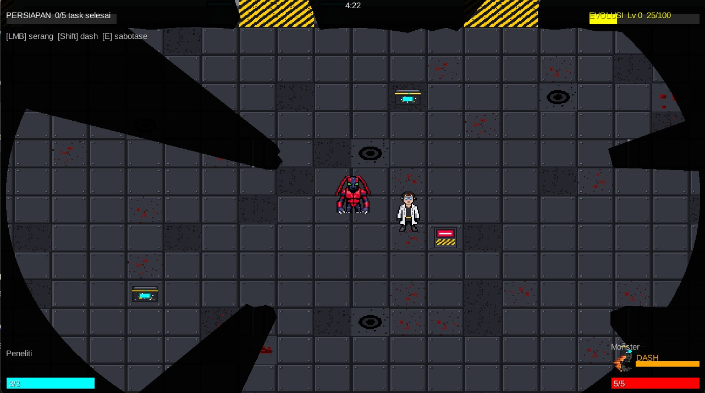<br><em>Fase Preparation — Fog of War dan task marker</em>
</td>
<td align="center" width="50%">
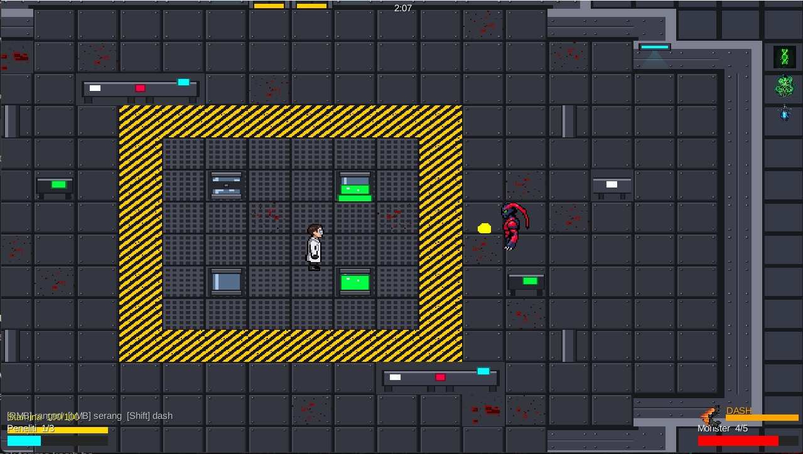<br><em>Fase Duel — pertempuran langsung di arena</em>
</td>
</tr>
<tr>
<td align="center" width="50%">
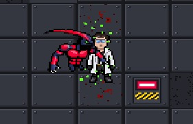<br><em>Monster menyerang Peneliti</em>
</td>
<td align="center" width="50%">
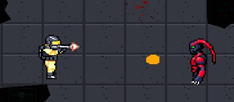<br><em>Guard NPC menembak Monster</em>
</td>
</tr>
</table>

### Mini-Game Tasks

<table>
<tr>
<td align="center" width="50%">
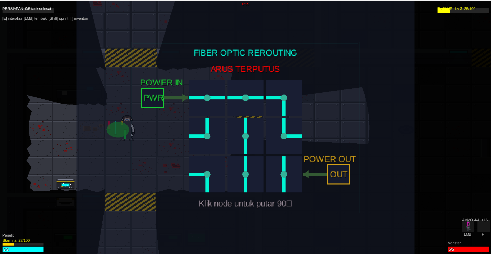<br><em>Task Rangkaian Kawat</em>
</td>
<td align="center" width="50%">
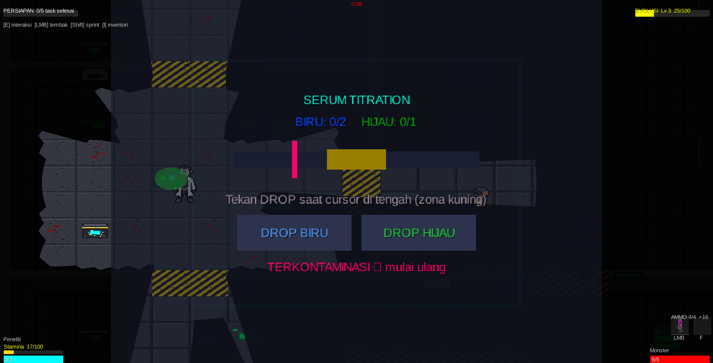<br><em>Task Campuran Kimia (Serum Titrasi)</em>
</td>
</tr>
</table>

### Multiplayer Room

<table>
<tr>
<td align="center" width="50%">
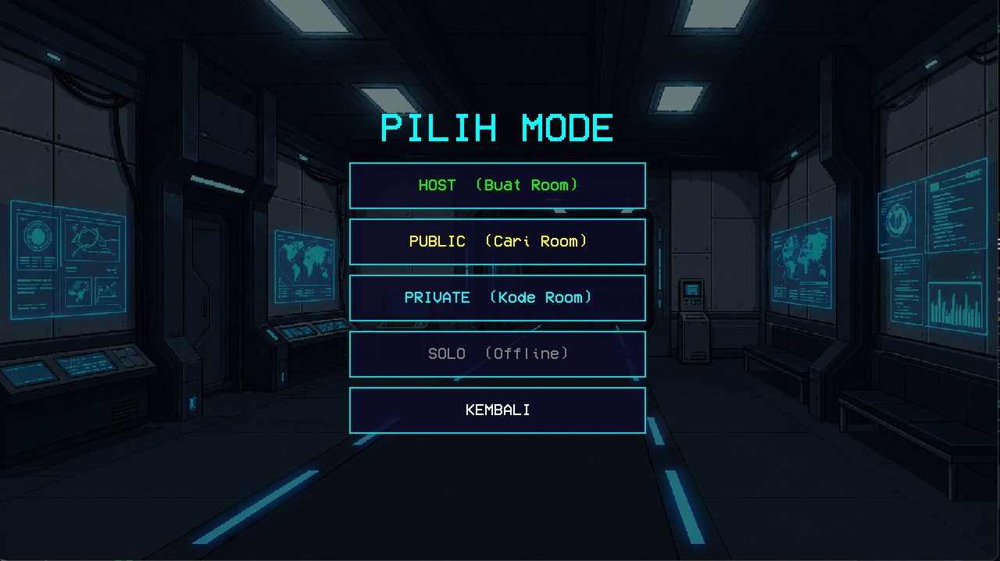<br><em>Pilih mode permainan</em>
</td>
<td align="center" width="50%">
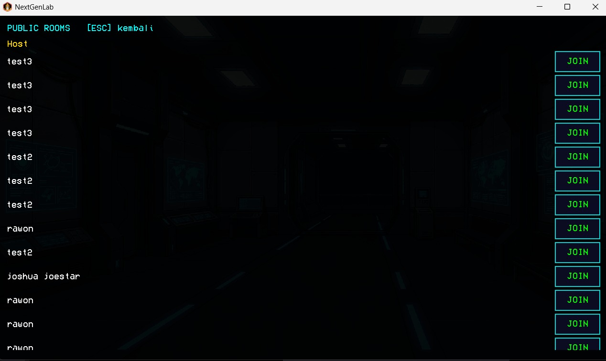<br><em>Daftar room publik tersedia</em>
</td>
</tr>
<tr>
<td align="center" width="50%">
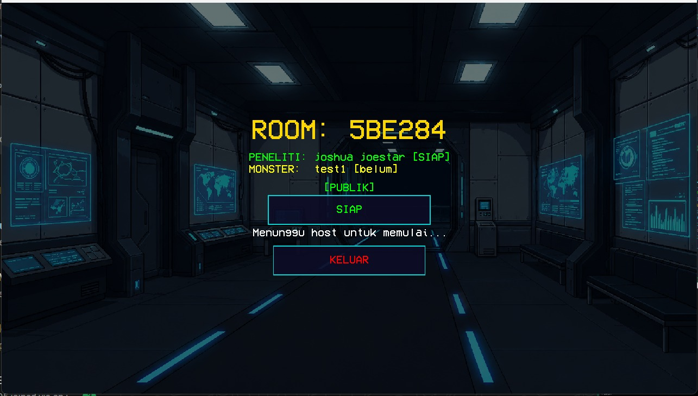<br><em>Menunggu pemain kedua di room</em>
</td>
<td align="center" width="50%">
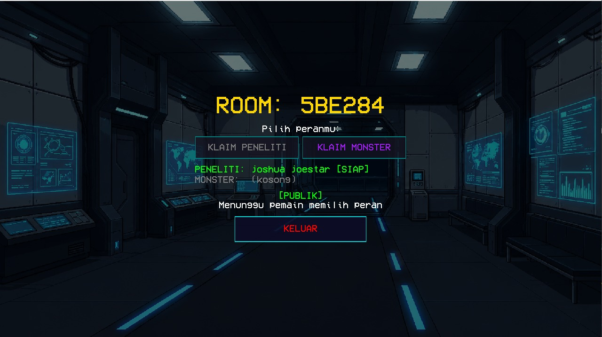<br><em>Memilih role — Peneliti atau Monster</em>
</td>
</tr>
</table>

### Progression & Social

<table>
<tr>
<td align="center" width="50%">
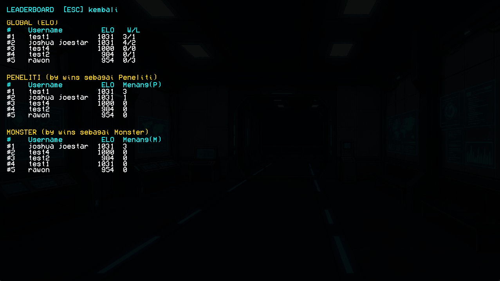<br><em>Leaderboard global per role</em>
</td>
<td align="center" width="50%">
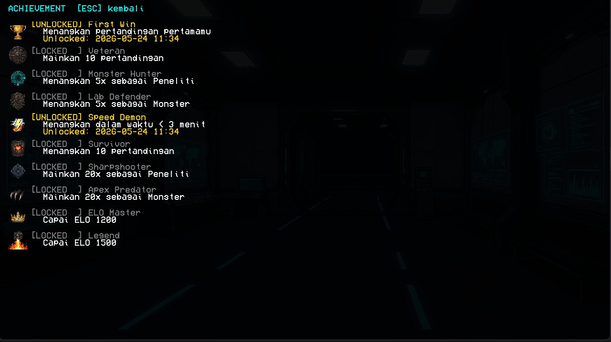<br><em>Sistem achievement (10 achievement)</em>
</td>
</tr>
<tr>
<td align="center" width="50%">
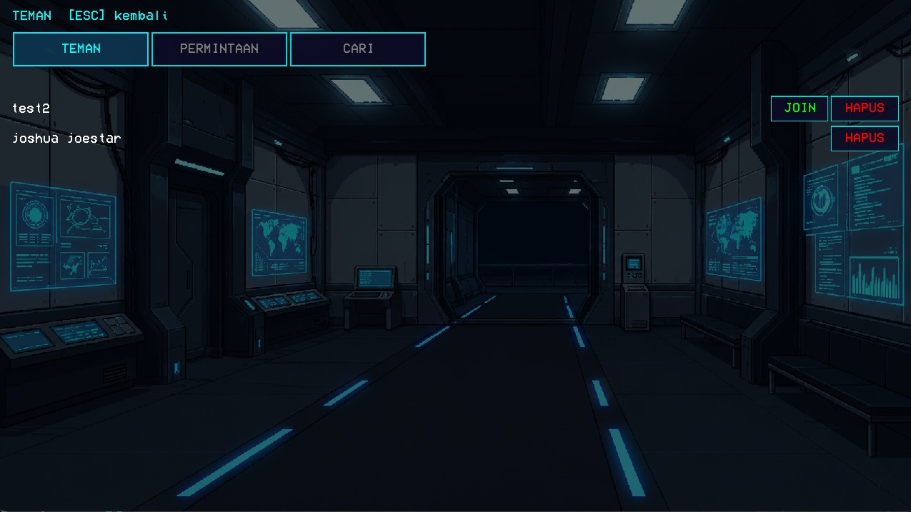<br><em>Sistem pertemanan dan invite</em>
</td>
<td align="center" width="50%">
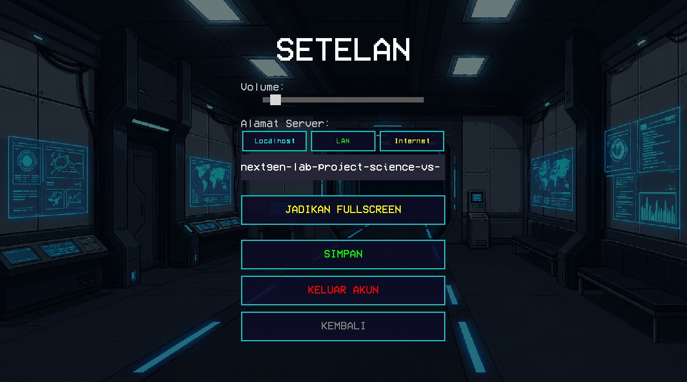<br><em>Pengaturan audio dan tampilan</em>
</td>
</tr>
</table>

---

---

## Untuk Developer / Penilai

### Tech Stack

| Komponen | Teknologi |
|---|---|
| Game Frontend | LibGDX 1.13.1 + LWJGL3 (Java 8) |
| Game Backend | Spring Boot 4.0.6 (Java 17) |
| Database | PostgreSQL 14+ |
| Build Tool | Gradle (multi-module) |
| Networking | LibGDX Gdx.net (HTTP) + WebSocket |
| Map Editor | Tiled Map Editor |

---

### Persyaratan Sistem

- **JDK 17+**
- **PostgreSQL 14+** berjalan di port 5432
- Gradle wrapper sudah tersedia (`gradlew`)

---

### Cara Menjalankan

**1. Setup Database**

```sql
CREATE DATABASE nextgenlab_db;
```

Konfigurasi: `Backend/src/main/resources/application.properties`  
Default: `postgres:postgres` @ `localhost:5432`

**2. Jalankan Backend**

```bash
cd Backend
./gradlew bootRun
```

Health check: `GET http://localhost:8080/api/status`

**3. Jalankan Game**

```bash
cd Game
./gradlew lwjgl3:run
```

**4. Build Distribusi**

```bash
cd Game && ./gradlew lwjgl3:jar      # fat JAR game
cd Backend && ./gradlew build        # JAR backend
```

---

### Struktur Repository

```
NextGenLab_Project/
├── Game/
│   ├── core/src/main/java/com/nextgenlab/game/
│   │   ├── facade/        # Facade Pattern (AssetFacade, AudioFacade, BackendFacade)
│   │   ├── factory/       # Factory Pattern (EntityFactory)
│   │   ├── command/       # Command Pattern (MoveCommand, InputHandler)
│   │   ├── state/         # State Pattern (PreparationState, DuelState)
│   │   ├── strategy/      # Strategy Pattern (AI movement)
│   │   ├── pool/          # Object Pool Pattern (ProjectilePool)
│   │   ├── task/          # Template Method Pattern (LabTask + subclasses)
│   │   ├── event/         # Observer Pattern (EventBus, GameEventListener)
│   │   ├── entity/        # Game entities
│   │   ├── screen/        # LibGDX screens
│   │   ├── rendering/     # FogOfWarRenderer
│   │   ├── ui/            # HUD, InventoryPanel, CraftingPanel
│   │   └── network/       # Multiplayer transport
│   └── assets/            # Sprites, maps, audio
├── Backend/
│   └── src/main/java/com/nextgenlab/backend/
│       ├── controller/    # REST API (10 controllers)
│       ├── model/entity/  # JPA entities (9 tabel)
│       ├── model/dto/     # Request/response DTOs
│       ├── repository/    # Spring Data JPA (9 repositories)
│       └── service/       # Business logic
├── Docs/
│   ├── DESIGN_PATTERNS.md
│   └── API_REFERENCE.md
├── Database/
│   └── schema.sql
└── README.md
```

---

### Design Patterns

Game mengimplementasikan **8 Design Pattern** (tidak termasuk Game Loop):

| # | Pattern | Package | Class Utama | Tujuan |
|---|---|---|---|---|
| 1 | Facade | `facade/` | AssetFacade, AudioFacade, BackendFacade | Sederhanakan akses ke subsistem aset, audio, HTTP |
| 2 | Factory | `factory/` | EntityFactory | Pusatkan dan standarisasi pembuatan entitas game |
| 3 | Command | `command/` | MoveCommand, InputHandler | Enkapsulasi input pergerakan sebagai objek perintah |
| 4 | State | `state/` | PreparationState, DuelState | Manajemen transisi fase game |
| 5 | Strategy | `strategy/` | ChasePlayerStrategy, PatrolStrategy | AI movement yang dapat dipertukarkan saat runtime |
| 6 | Object Pool | `pool/` | ProjectilePool, Projectile | Reuse proyektil untuk efisiensi memori |
| 7 | Template Method | `task/` | LabTask (abstract) + 5 subclass | Kerangka task seragam dengan UI berbeda tiap subclass |
| 8 | Observer | `event/` | EventBus, GameEventListener | Notifikasi event antar komponen tanpa coupling langsung |
| + | Singleton | `facade/` | AssetFacade, AudioFacade, EventBus | Satu instance per runtime aplikasi |

**Observer Pattern — detail:**  
`EventBus` bertindak sebagai Subject yang menyimpan subscriber. `GameEventListener<E>` adalah Observer interface (functional interface). Komponen subscribe ke event type tertentu dan menerima notifikasi saat event dipublish.

```java
// Subscribe (Observer mendaftar ke Subject)
EventBus.getInstance().subscribe(OnTaskCompleted.class, e -> playSfx("sfx_task_complete"));
EventBus.getInstance().subscribe(OnGuardKilled.class,   e -> playSfx("sfx_hit"));

// Publish (Subject memberitahu semua Observer)
EventBus.getInstance().publish(new OnTaskCompleted(tasksCompleted, taskName, TOTAL_TASKS));
```

Event yang tersedia: `OnTaskCompleted`, `OnGuardKilled`, `OnMonsterLevelUp`, `OnPlayerHit`, `OnSerumProgress`

---

### Diagram

#### ERD

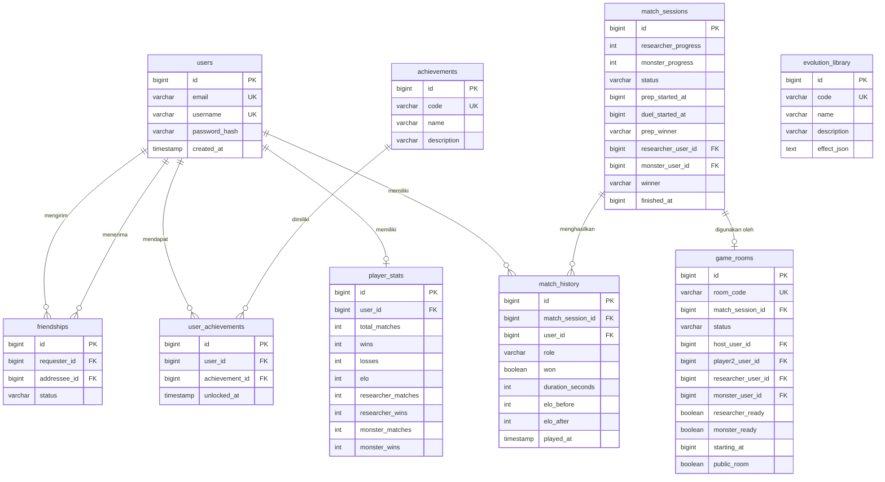

---

#### Arsitektur Sistem

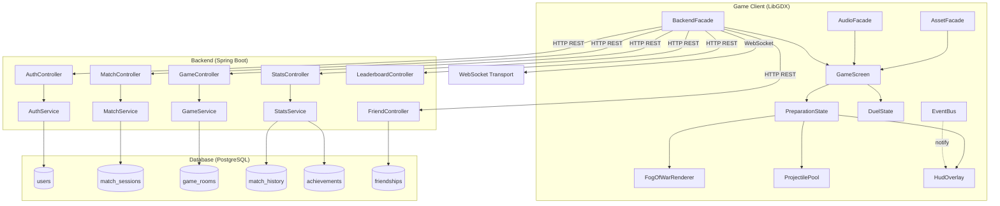

---

#### Alur Game

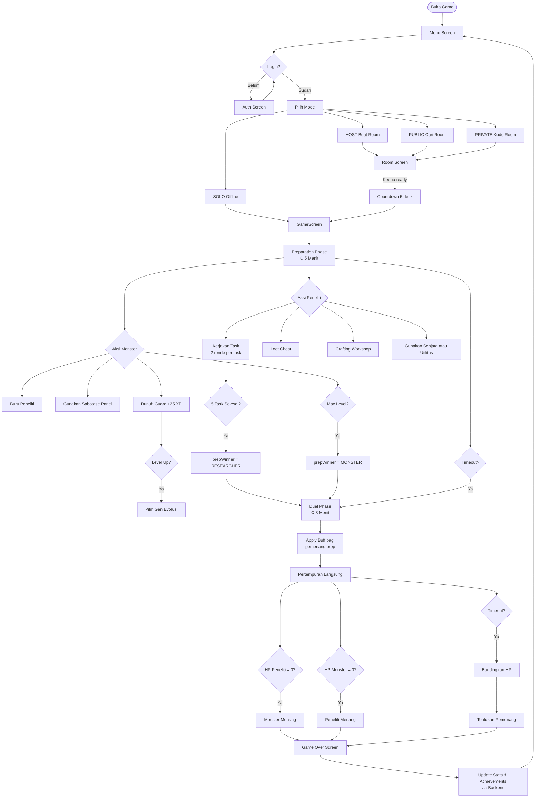

---

#### Sequence Diagram — Multiplayer Match

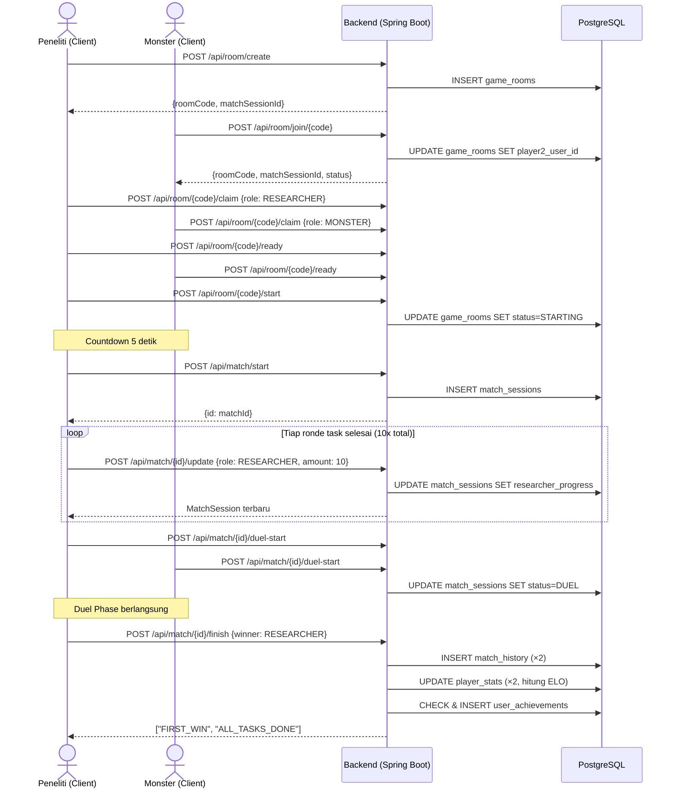

---

#### Class Diagram — Design Patterns

```mermaid
classDiagram
    direction TB

    class GameStateHandler {
        <<interface>>
        +enter(screen)
        +update(delta, screen)
        +render(screen)
        +exit(screen)
        +resize(screen, w, h)
        +dispose()
    }
    class PreparationState {
        -tasks LabTask[]
        -tasksCompleted int
        -fogRenderer FogOfWarRenderer
        -projectilePool ProjectilePool
    }
    class DuelState {
        -projectilePool ProjectilePool
        -reloadBoostActive boolean
    }
    GameStateHandler <|.. PreparationState
    GameStateHandler <|.. DuelState

    class MovementStrategy {
        <<interface>>
        +move(monster, tx, ty, delta)
    }
    class ChasePlayerStrategy
    class PatrolStrategy {
        -wpX float[]
        -wpY float[]
    }
    MovementStrategy <|.. ChasePlayerStrategy
    MovementStrategy <|.. PatrolStrategy

    class LabTask {
        <<abstract>>
        #stage Stage
        #isCompleted boolean
        +buildUI()*
        +finishTask()
        +render()
        +dispose()
    }
    class WireTask
    class ServerHackTask
    class ReactorTask
    class ChemicalMixTask
    class BiometricLockTask
    LabTask <|-- WireTask
    LabTask <|-- ServerHackTask
    LabTask <|-- ReactorTask
    LabTask <|-- ChemicalMixTask
    LabTask <|-- BiometricLockTask

    class ProjectilePool {
        +obtain() Projectile
        +updateAll(delta)
        +renderAll(batch)
    }
    class Projectile {
        +x, y float
        +active boolean
        +init(x,y,dx,dy,type,speed)
        +reset()
    }
    ProjectilePool o-- Projectile

    class GameEventListener {
        <<interface>>
        +onEvent(E event)
    }
    class EventBus {
        -instance EventBus
        +getInstance() EventBus
        +subscribe(type, listener)
        +unsubscribe(type, listener)
        +publish(event)
    }
    EventBus o-- GameEventListener

    class AssetFacade {
        -instance AssetFacade
        +getInstance() AssetFacade
        +getMap(name) TiledMap
        +getTexture(name) Texture
    }
    class AudioFacade {
        -instance AudioFacade
        +getInstance() AudioFacade
        +playSfx(name)
        +playBgm(name)
    }
    class BackendFacade {
        +login(email, pass, cb)
        +startMatch(cb)
        +sendProgressUpdate(id, role, amt)
        +finishMatch(id, winner, cb)
    }

    class EntityFactory {
        +createResearcher(x, y, map) Researcher
        +createMonster(x, y, map) Monster
        +createGuard(x, y, map) Guard
        +createChest(x, y, rng) Chest
    }

    class MoveCommand {
        <<interface>>
        +execute(researcher, delta)
    }
    class InputHandler {
        +resolve() MoveCommand
        +isSprintHeld() boolean
    }
```

---

### REST API Ringkasan

| Grup | Method | Endpoint | Deskripsi |
|---|---|---|---|
| Auth | POST | `/api/auth/register` | Daftar akun |
| Auth | POST | `/api/auth/login` | Login, dapat JWT |
| Auth | GET | `/api/auth/me` | Info user aktif |
| Match | POST | `/api/match/start` | Buat sesi match |
| Match | POST | `/api/match/{id}/update` | Update progres |
| Match | GET | `/api/match/{id}/status` | Status match |
| Match | POST | `/api/match/{id}/duel-start` | Notif mulai duel |
| Match | POST | `/api/match/{id}/finish` | Selesaikan match |
| Room | POST | `/api/room/create` | Buat room |
| Room | POST | `/api/room/join/{code}` | Gabung room |
| Room | GET | `/api/room/list` | Daftar room publik |
| Room | GET | `/api/room/{code}` | Detail room |
| Room | POST | `/api/room/{code}/claim` | Klaim role |
| Room | POST | `/api/room/{code}/ready` | Siap |
| Room | POST | `/api/room/{code}/start` | Mulai countdown |
| Room | POST | `/api/room/{code}/leave` | Keluar room |
| Room | POST | `/api/room/{code}/kick/{uid}` | Kick pemain |
| Stats | GET | `/api/stats/{userId}` | Statistik pemain |
| Stats | GET | `/api/stats/{userId}/history` | Riwayat match |
| Stats | GET | `/api/leaderboard` | Leaderboard global |
| Achievement | GET | `/api/achievements/user/{uid}` | Achievement pemain |
| Friends | POST | `/api/friends/request` | Kirim permintaan |
| Friends | PUT | `/api/friends/accept/{id}` | Terima permintaan |
| Friends | GET | `/api/friends` | Daftar teman |
| Friends | DELETE | `/api/friends/{uid}` | Hapus teman |
| Users | GET | `/api/users/search` | Cari pemain |

Dokumentasi lengkap: [`Docs/API_REFERENCE.md`](Docs/API_REFERENCE.md)

---

## Kontributor

| Nama | NIM | Peran |
|---|---|---|
| Akbar Anvasa Faraby | 2406405361 | Developer (Frontend + Backend) |

---

## Lisensi

Proyek ini dibuat untuk keperluan Seleksi Asisten Laboratorium Netlab 2026.
